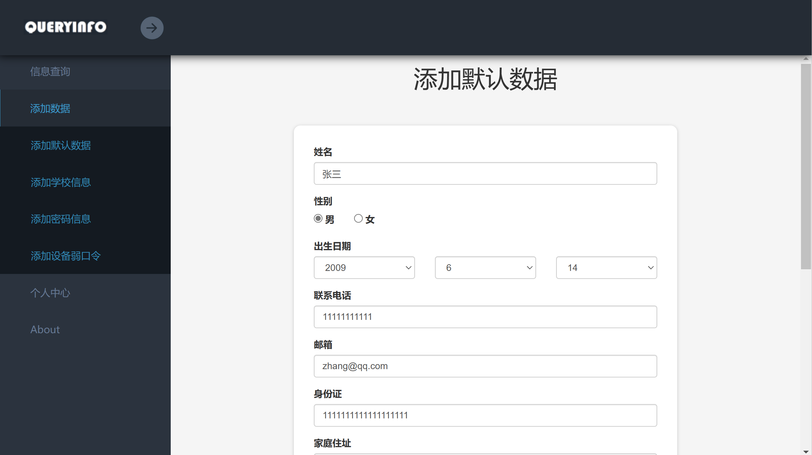
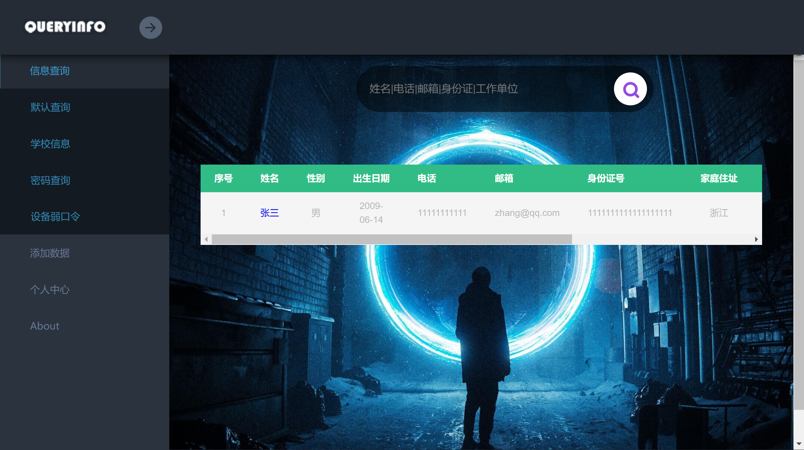
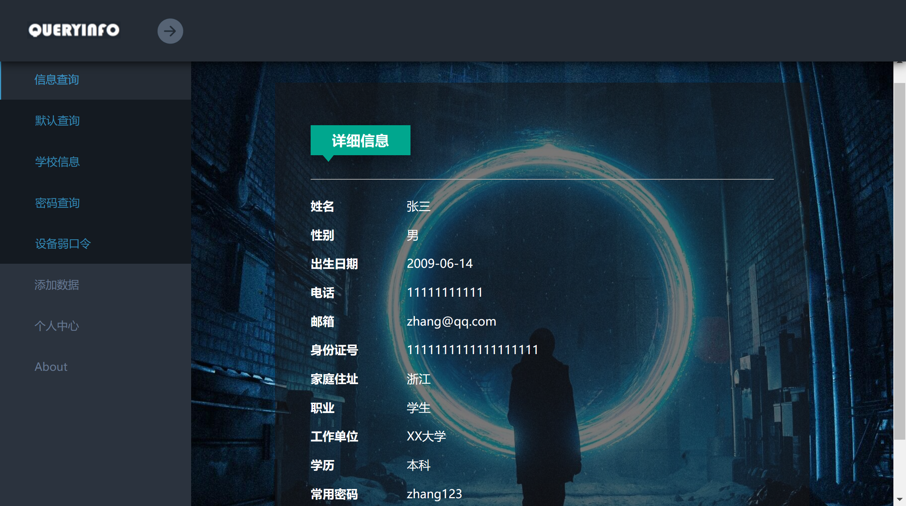
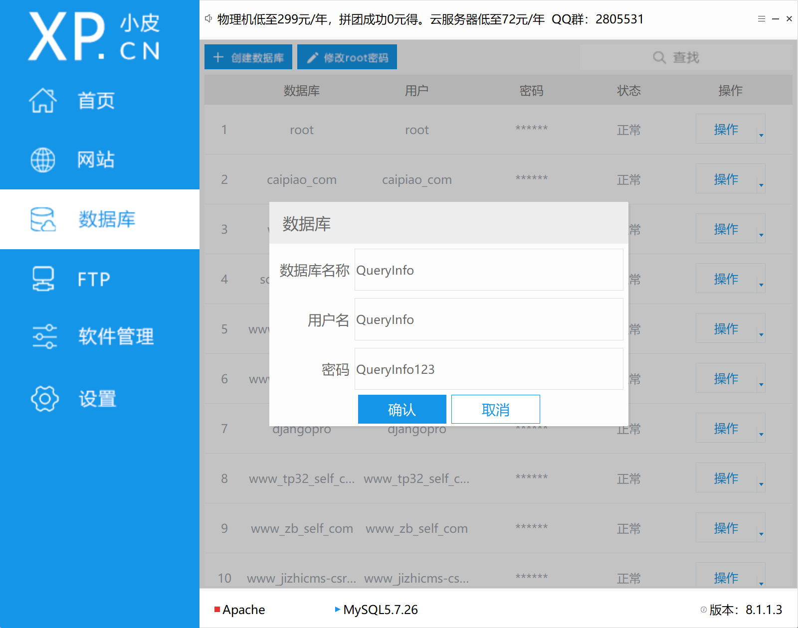
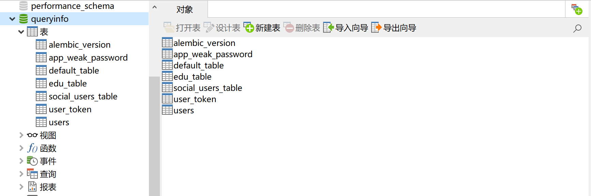
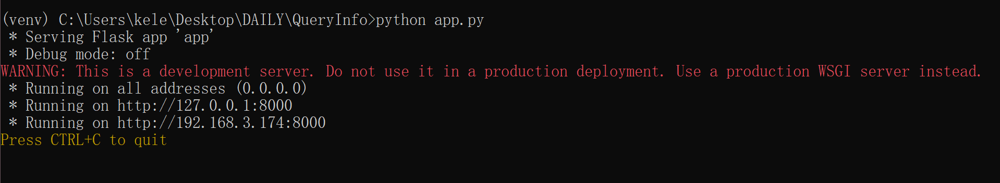
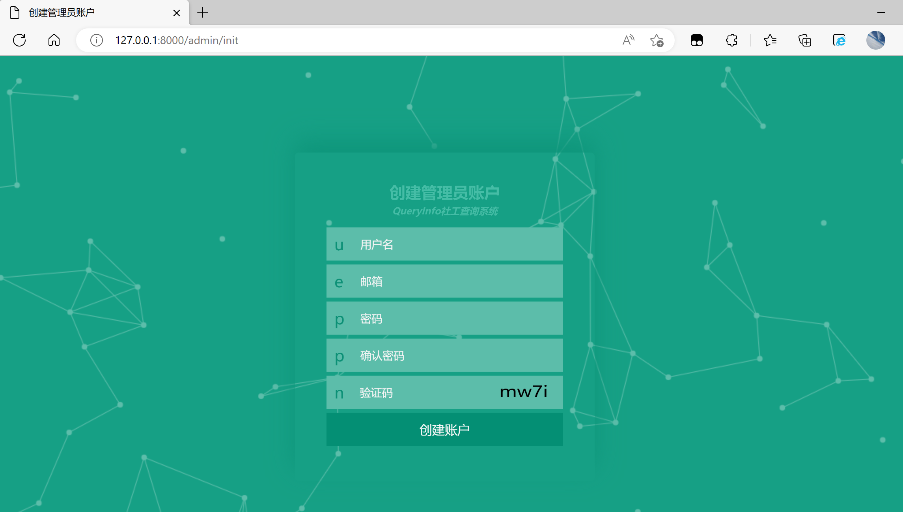
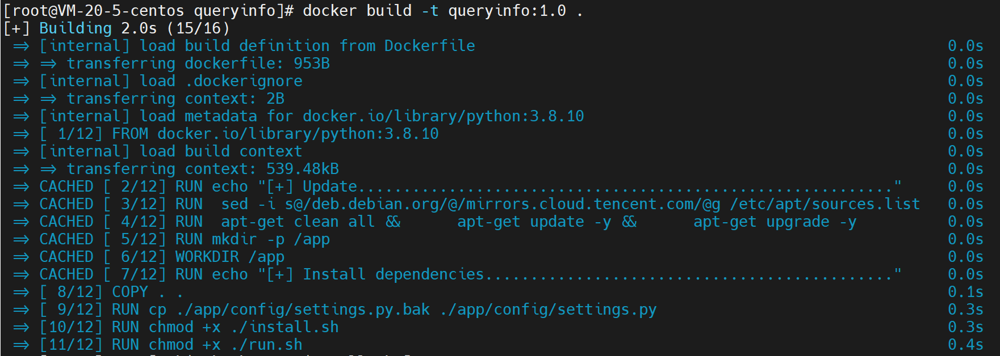
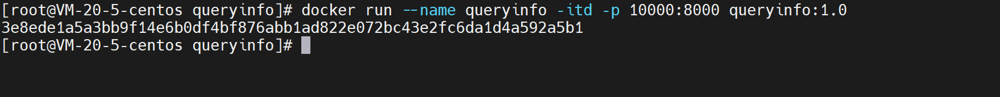
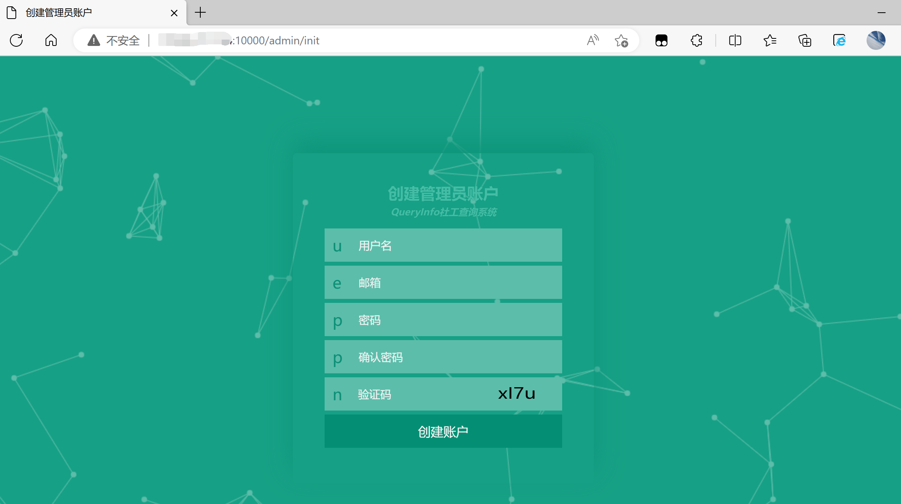

# QueryInfo社工查询系统

## About

在日常做一些信息搜集的工作中，比如挖掘SRC等等，遇到某些登陆站点时，会尝试跑一下弱口令，所以经常会有去Google搜索的需求，不过挖完了可能也就遗忘了，为了方便对这些搜集到的信息进行整理，所以开发了 QueryInfo社工查询系统，目的旨在于信息整理，减少繁杂的搜集工作。

此项目基于 `Flask + MySQL` 开发，提供了多个模块整理个人信息，可以很方便的添加目标和查询


## 支持

### 支持查询：

```bash
姓名
电话
邮箱
身份证
工作单位
学号|工号
账户
常见设备弱口令
```


### 使用语法：

```bash
# 默认模块：
name=张三
tel='11111111111'
email='zhang@qq.com'
id_card='222031922052386743'
workplace='百度'

# 学校信息模块新增：
stu_card=''
job_card=''

# 密码查询：
uid=79910232
name='wanghh'
email='zhang@qq.com'
qq=1111111111
wechat=wang798123
weibo=1111111111
tel='11111111111'
category=qq

# 设备弱口令：
app=phpcms
jizhicms
```


## 示例

- 添加信息




- 查询信息






## 安装

### 本地安装

推荐使用本地安装，以PHPStudy为例：

- 先下载项目

```bash
git clone https://github.com/kelesec/QueryInfo.git
```


- 修改 `app/config/settions.py.bak` 为 `app/config/settions.py` ，然后根据需求配置信息

> 邮箱信息非必要，可以不用配置，主要用于找回密码使用，本地使用可忽略

```python
# 数据库信息
db_host     =   '127.0.0.1'		# host
db_port     =   '3306'			# port
db_user     =   'QueryInfo'		# 用户名
db_passwd   =   'QueryInfo123'	# 密码
db_name     =   'QueryInfo'		# 数据库密码

# 配置SECRET_KEY，不要使用默认的SECRET_KEY
SECRET_KEY=''

# 配置邮箱信息
MAIL_PASSWORD       =   ''		# 认证密码
MAIL_USERNAME       =   ''		# 邮箱账号
MAIL_DEFAULT_SENDER =   ''		# 默认账户
```


- 在PHPStudy中创建一个数据库




- 创建虚拟环境，然后安装依赖

```bash
# 创建&激活虚拟环境
python -m venv venv
.\venv\Scripts\activate.bat

# 安装依赖
pip install -r requirements.txt
```


- 创建数据库模型

```bash
flask db init
flask db migrate
flask db upgrade
```




- 启动项目：启动成功后创建账户即可

```bash
python app.py
```






### Docker安装

项目支持使用Docker安装，只需要有docker环境即可，以Centos为例：

- 先下载项目，然后根据需求配置一下 `app/config/settings.py.bak` （这里不需要修改文件名），配置的内容与前面的一样
- 然后配置 `install.sh` 脚本文件，第一个是root账户密码，可以随意，后面三个与 `settings.py.bak` 对于即可

```bash
# configuration
MYSQL_ROOT_PASSWORD="root#pass123"
MYSQL_QUERYINFO_DBNAME="QueryInfo"
MYSQL_QUERYINFO_USER="QueryInfo"
MYSQL_QUERYINFO_PASSWORD="QueryInfo123"
```


- 构建镜像

```bash
docker build -t queryinfo:1.0 .
```




- 启动容器

```bash
docker run --name queryinfo -itd -p 10000:8000 queryinfo:1.0
```




- 访问对应端口服务即可




## 最后

前端的设计主要还是来源于网络（主要是一些第三方网站），在此表示感谢

**此项目只用于学习交流使用，切勿用于非法行为，应当遵守国家法律，如不听劝告，造成的一切后果与本人无关**

